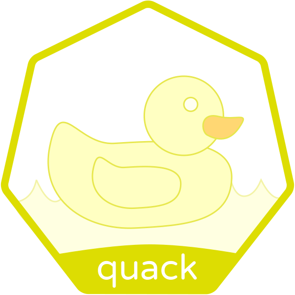

# Quack

> NOTE: this repository is currently **UNMAINTAINED** and is looking for new owner(s).
> See [#19](/../../issues/19) for more information.

In-Cluster templating using the Go Template syntax.

**Note:** This is a proof of concept in the early alpha stage.
We are providing no guarantees.
We also cannot provide support for Kubernetes configuration,
Mutating Webhooks are currently beta and the required configuration is
complex.
Please see the [Installation](#installation) section for further detail.

## Table of contents

- [Introduction](#introduction)
- [Installation](#installation)
  - [Deploying to Kubernetes](#deploying-to-kubernetes)
  - [Configuration](#configuration)
- [Example Quack Template](#example-quack-template)
  - [Custom Delimiters](#custom-delimiters)
- [Quack vs Other Systems](#quack-vs-other-systems)
- [Communication](#communication)
- [Contributing](#contributing)
- [License](#license)

## Introduction

Client Side templating can be error prone. When running multiple Kubernetes
clusters it can be very easy to apply rendered templates to the wrong
cluster.

Quack solves this problem by rendering the templates as they are applied to the
cluster.

Quack acts as a Mutating Webhook Admission Controller and intercepts requests to
create and update Kubernetes resources such as Deployments, Ingresses and
ConfigMaps.

Any resource that contains Go Template syntax will be templated (using values
from Quack's ConfigMap) before it passes through API validation.

Quack is ideal for templating Cluster-wide environment such as the Cluster Name,
Region and Environment (Staging/Production).

## Installation

### Deploying to Kubernetes

Example Kubernetes manifests are in the [deploy](/deploy) folder.

#### Quack RBAC

Quack uses RBAC to ensure that requests for templating are authorized.
If you are running RBAC within your Kubernetes cluster you must ensure that
you configure Webhook Authentication in your Kubernetes API server.
[See the docs.](https://github.com/kubernetes/website/blob/49a81e1a69a0d7d0b8f98bf7119583b025517792/docs/admin/extensible-admission-controllers.md#authenticate-apiservers)

Once you have configured the API server authentication, ensure you update the
[API Server ClusterRoleBinding](/deploy/crb-quack-apiserver.yaml) with the
appropriate subject.

#### Certificates

Quack requires a TLS certificate for serving the webhook securely.
This certificate **must** be signed by a CA certificate.

In Kubernetes 1.9, Webhooks must be called over HTTPS and the serving
certificate's CA bundle must be configured in the
[MutatingWebhookConfiguration](deploy/mutatingwebhookconfiguration.yaml).
This establishes trust between the API server and Quack.

Base64 encode your CA certificate bundle and substitute it for the `caBundle`
field in the
[MutatingWebhookConfiguration](deploy/mutatingwebhookconfiguration.yaml).

The example [Daemonset](deploy/daemonset.yaml) expects a secret containing the
certificate in the format as below:

```yaml
apiVersion: v1
data:
  cert.pem: <BASE64_ENCODED_CERTIFICATE>
  key.pem: <BASE64_ENCODED_PRIVATE_KEY>
kind: Secret
metadata:
  name: quack-certs
  namespace: quack
type: Opaque
```

### Configuration

Quack adopts the standard Kubernetes Generic API server flags (including
Authentication and Authorization flags).
It loads the In Cluster configuration by default but this can be overridden
by the `--kubeconfig` flag.

Quack takes the following additional flags:

- `--values-configmap` (Default: `quack-values`): Defines the name of the
  ConfigMap to load cluster level template values from.
- `--values-configmap-namespace` (Default: `quack`): Defines the namespace in
  which the Values ConfigMap exists.
- `--required-annotation`: Filter objects based on the existence of a named
  annotation before templating them.
- `--ignore-path`: Ignore patches for certain paths in when templating files.
  May be called multiple times. Paths should be specified as
  [RFC6901 JSON Pointers](https://tools.ietf.org/html/rfc6901).

#### Restricting Quack

You should configure Quack to only template the resources you need it to
template.

There are three parts to restricting Quack:

##### Namespace

A Namespace selector in the
[MutatingWebhookConfiguration](deploy/mutatingwebhookconfiguration.yaml)
must be matched for resources within the Namespace to be templated by Quack.

```yaml
apiVersion: v1
kind: Namespace
metadata:
  name: kube-system
  labels:
    quack.pusher.com/enabled: "true"
```

##### Resource rules

A list of resoucre rules in the
[MutatingWebhookConfiguration](deploy/mutatingwebhookconfiguration.yaml)
must be matched for resources to be templated by Quack.

Add and remove resources to fit your requirements:

```yaml
rules:
  - operations: ["CREATE", "UPDATE"]
    apiGroups: ["*"]
    apiVersions: ["*"]
    resources:
      - configmaps
      - daemonsets
      - deployments
      - statefulsets
      - ingresses
      - services
```

##### Required annotation

Using the flag `--required-annotation`, you can tell Quack to skip templating
for any resource not annotated appropriately.

For example, if Quack is configured with
`--required-annotation=quack.pusher.com/template`, only resources (matching the
Resource rules and Namespace Selector) with an annotation as below will be
templated:

```yaml
---
apiVersion: v1
metadata:
  annotations:
    quack.pusher.com/template: "true" # The value is not checked.
```

## Example Quack Template

In this example, we are defining an Ingress object for the Kubernetes Dashboard.

We suppose that there is an existing Kubernetes cluster known as `alpha`.
We then assume that Quack is configured to watch the Namespace
`kube-system` and that a DNS record for `alpha.example.com` points to the
Ingress Controller on the Kubernetes cluster `alpha`.

In this case, the Quack installation might have the ConfigMap:

```yaml
apiVersion: v1
kind: ConfigMap
metadata:
  name: quack-values
  namespace: quack
data:
  ClusterName: alpha
```

Create the Ingress object as below and apply it to the cluster:

```sh
kubectl apply -f ingress.yaml
```

ingress.yaml:

```yaml
apiVersion: extensions/v1beta1
kind: Ingress
metadata:
  name: kubernetes-dashboard
  namespace: kube-system
spec:
  tls:
    - hosts:
        - "{{- .ClusterName -}}.example.com"
  rules:
    - host: "{{- .ClusterName -}}.example.com"
      http:
        paths:
          - path: /ui
            backend:
              serviceName: kubernetes-dashboard
              servicePort: 443
```

Once applied, fetch the Ingress object to see that it has been templated
appropriately by Quack:

```sh
kubectl get -f ingress.yaml -o yaml
apiVersion: extensions/v1beta1
kind: Ingress
metadata:
  name: kubernetes-dashboard
  namespace: kube-system
spec:
  tls:
    - hosts:
        - "alpha.example.com"
  rules:
    - host: "alpha.example.com"
      http:
        paths:
          - path: /ui
            backend:
              serviceName: kubernetes-dashboard
              servicePort: 443
```

When creating further Kubernetes clusters, the same template can be applied
directly to each cluster and the resulting Kubernetes resources will be correct
for their cluster's particular environment.

### Custom Delimiters

Each individual Quack template can specify their own delimiters for use against
the template.

Add annotations `quack.pusher.com/left-delim` and `quack.pusher.com/right-delim`
to your template with the desired left and right template delimiters
respectively.

```yaml
---
apiVersion: v1
metadata:
  annotations:
    quack.pusher.com/left-delim: "[["
    quack.pusher.com/right-delim: "]]"
...
spec:
  foo: "[[- .FooValue -]]"
```

## Quack vs Other Systems

- Quack intercepts the standard flow of `kubectl apply`. This means there are no
  extra tools and no additional syntax to learn, bar the Go Templating Syntax.
- Resources are still created using the main Kubernetes API server. This means
  that regular syntax validation and Authorization still happen as the object is
  being created or updated.
- Cluster specific values are stored in cluster and separate from your templates.
  Allows you to keep one copy of Kubernetes manifests and reuse them across all
  clusters without any client side changes.
- Protects against mistakenly applying manifests cross clusters. (Templates have
  no specific configuration for each cluster, Quack abstracts this.)

## Communication

- Found a bug? Please open an issue.
- Have a feature request. Please open an issue.
- If you want to contribute, please submit a pull request

## Contributing

Please see our [Contributing](CONTRIBUTING.md) guidelines.

## License

This project is licensed under Apache 2.0 and a copy of the license is available [here](LICENSE).
